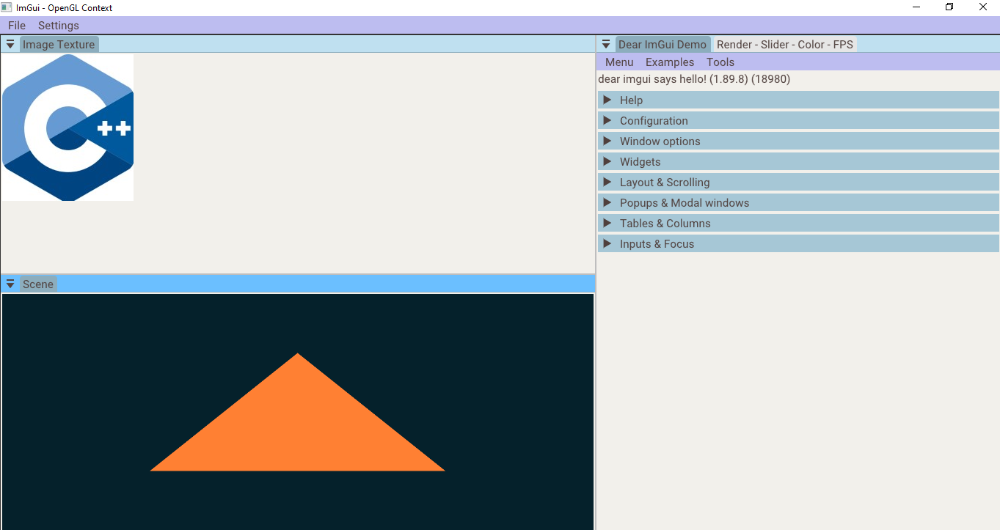

<h1 align="center"">ImGui Template - Visual Studio</h1>

  
  
  

                     
---

This project is a simple template to make desktop GUI apps with ImGui to be used with OpenGL. The template employs Visual Studio as the build system, targeting Windows.

---

- [1. Requirements](#1-requirements)
- [2. Build](#2-build)

## 1. Requirements
                      
- [Visual Studio 2022](https://visualstudio.microsoft.com/) (C++20 support)
- [OpenGL](https://www.opengl.org/)
- The template uses the [Roboto](https://fonts.google.com/specimen/Roboto) font ([Apache License, Version 2.0](https://www.apache.org/licenses/LICENSE-2.0))
                     
## 2. Build
                
Clone the repository and build the app:

* Clone recursively: `git clone --recursive https://github.com/fabianperdomolaguna/Imgui_Template_Visual_Studio.git`
* Open `Imgui_Template_VisualStudio.sln` 
* Select preferably configuration and build the solution
* Run the basic example and modify the project

<h1 align="center">
  
</h1>

Basic application in the template
